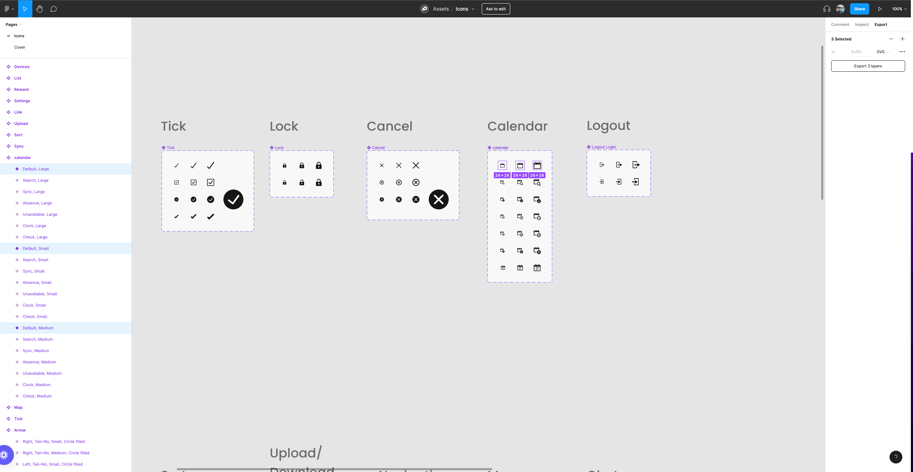
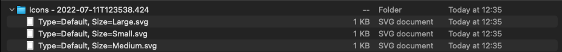
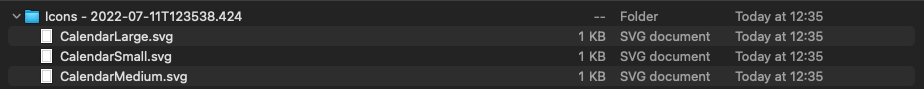
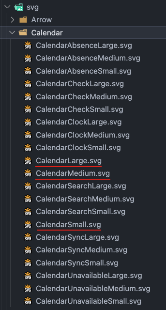

# Icons

This package exposes all available icons to our users as React components. It also
contains a generator script that easily allows adding icons.

## Setup

```
$ yarn setup
```
## How it works

We export the icons as `SVG` from [Figma](https://www.figma.com/file/TOOzFTATeKFcrbTeIuJr90/Icons) and generate React components via generator out of it.

The `SVG` source folder is located at `packages/icons/svg` and
the `output` folder is located at `packages/icons/src/icons`.

Whenever the generator runs it will also automatically create the Storybook `stories`.

## Adding icons from Figma

1. Go to the [Icons sheet on Figma](https://www.figma.com/file/TOOzFTATeKFcrbTeIuJr90/Icons) and export the icon(s) that you want to add incl. all size variants (small, medium and large) as `SVG`.



2. Extract zip archive.



3. Rename icons in `PascalCase` style and at the end of the name, add the size variant, e.g. `Small`.



4. Copy icons into `svg/__CATEGORY__` source folder.



5. Run the icons generator:

```
$ yarn generate:icons
```

6. Create PR
