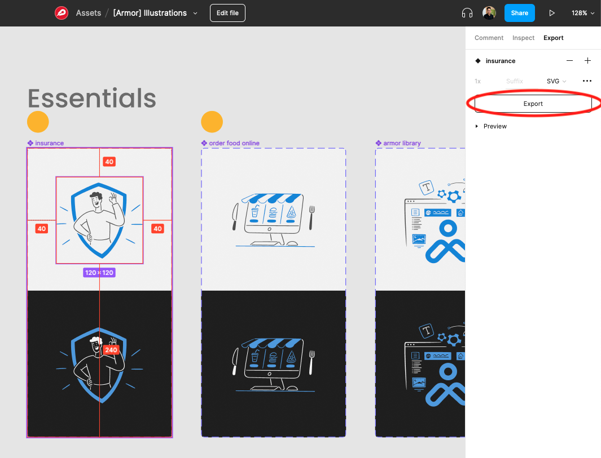
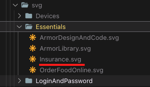

# Illustrations

This package exposes all available illustrations to our users as React components. It also
contains a generator script that easily allows adding illustrations.

## Setup

```
$ yarn setup
```
## How it works

We export the illustrations as `SVG` from [Figma](https://www.figma.com/file/UmZsPHMUvk4WQ0dO0iGtGm/%5BArmor%5D-Illustrations) and generate React components via generator out of it.

The `SVG` source folder is located at `packages/illustrations/svg` and
the `output` folder is located at `packages/illustrations/src/illustrations`.

Whenever the generator runs it will also automatically create the Storybook `stories`.

## Adding illustrations from Figma

1. Go to the [Illustrations sheet on Figma](https://www.figma.com/file/UmZsPHMUvk4WQ0dO0iGtGm/%5BArmor%5D-Illustrations) and export the illustrations(s) that you want to add as `SVG`.



2. Rename illustration in `PascalCase` style & copy it into `svg/__CATEGORY__` source folder.



3. Run the illustrations generator:

```
$ yarn generate:illustrations
```

4. Create PR
